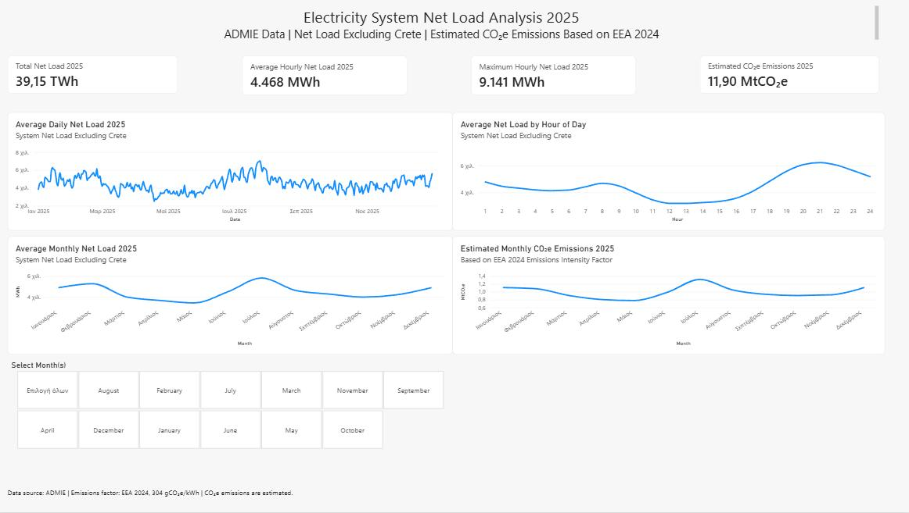

# greek-energy-load-co2e-analysis
Power BI analysis of 2025 ADMIE hourly net load data (excluding Crete), including temporal patterns, data quality checks and estimated CO₂e emissions.
# Greek Energy Load & CO₂e Analysis

## Project Overview
This project analyzes 2025 hourly electricity system net load data from ADMIE, excluding Crete.

The goal was to transform raw operational energy data into an interactive Power BI dashboard that highlights annual, monthly, daily and hourly load patterns, while also providing an estimate of associated CO₂e emissions.

## Data Source
- Source: ADMIE – Independent Power Transmission Operator
- Period: 2025
- Frequency: Hourly
- Metric analyzed: Net Load Without Crete (MWh)

## Tools Used
- Power BI
- Power Query
- DAX
- Python
- Excel

## Data Preparation
The original ADMIE data consisted of daily Excel files with hourly values stored across separate columns.

The main preparation steps included:

- Combining daily ADMIE files
- Cleaning and validating the dataset
- Converting hourly columns into a long Date–Hour–Load structure using Unpivot
- Checking for null values and errors
- Handling the 25th-hour field related to daylight-saving-time structure
- Verifying unusual source values directly against the original ADMIE files
- Keeping verified source values instead of replacing them without evidence

## Key KPIs

| KPI | Result |
|---|---:|
| Total Net Load 2025 | 39.15 TWh |
| Average Hourly Net Load | 4,468 MWh |
| Maximum Hourly Net Load | 9,141 MWh |
| Estimated CO₂e Emissions | 11.90 MtCO₂e |

The maximum hourly load was recorded on **24 July 2025, Hour 21**, with **9,141 MWh**.

## Dashboard Analysis
The Power BI dashboard includes:

- Daily average net load
- Average load by hour of day
- Monthly average net load
- Estimated monthly CO₂e emissions
- Interactive month slicer
- Detailed Date–Hour–Load table

## Key Insights
- Electricity system load shows clear seasonal variation during the year.
- Higher average load levels are visible during the summer period, with a strong peak in July.
- The hourly profile shows lower average load around midday and higher values during evening hours.
- The highest hourly values are concentrated around late July.
- Estimated monthly CO₂e emissions follow the load pattern because a fixed emissions-intensity factor is applied.

## CO₂e Methodology
Estimated emissions were calculated using an emissions-intensity factor of:

**304 gCO₂e/kWh**

or equivalently:

**0.304 tCO₂e/MWh**

The factor is based on an EEA 2024 estimate and is used as a proxy for the 2025 analysis.

Therefore, the CO₂e results in this project should be interpreted as **estimates rather than measured 2025 emissions**.

## Limitations
- The analyzed ADMIE dataset excludes Crete.
- A fixed emissions factor is used across the entire year.
- The model does not account for hourly changes in the electricity generation mix.
- Some unusual values were retained after verification against the original ADMIE source files.
- Estimated emissions should not be interpreted as official measured emissions for 2025.

## Dashboard Preview

## Repository Contents
- [Power BI Dashboard](Greek_Energy_Consumption_CO2_Dashboard.pbix)
- [Python Data Download Script](download_admie_system_load_2025.py)
- [Dashboard Screenshot](dashboard-overview.png)
- README documentation
